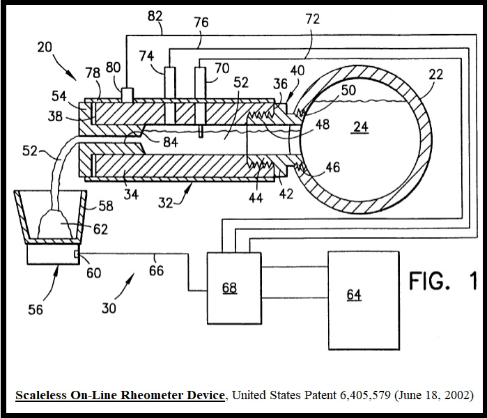

# Data Science and Engineering Portfolio: Scott S. Haraburda

## Brief Biography

 Dr. Scott Haraburda worked in the United States Army, in either military or civilian positions. He served in a variety of enlisted and commissioned officer positions on active and reserve duty within the medical service corps, chemical corps, engineer corps, and acquisition corps. He retired from military service in the United States Army as a Colonel. Prior to his retirement from the military, Colonel Haraburda served as the Commander of the 464th Chemical Brigade and Commander of the 472nd Chemical Battalion. Also, Colonel Haraburda deployed to Kuwait as the Senior Logistics Support Officer in support of Logistics Civil Augmentation Program (LOGCAP). And, he served as the Executive Secretary for the Army Science Board at the Pentagon.

His civilian Army positions include project management duties for the destruction of VX nerve agent at the Newport Chemical Agent Disposal Facility, along with munitions manufacturing, supply chain management, and data science duties for Crane Army Ammunition Activity. Also, Dr. Haraburda performed chemical engineering duties for Bayer Corporation and General Electric. 

Dr. Haraburda received an Associates in Arts from Grand Rapids Junior College, a Bachelor of Science in Chemistry from Central Michigan University, a Master in Strategic Studies from the United States Army War College, and a Doctor of Philosophy in Chemical Engineering from Michigan State University. He also graduated from the United States Air War College, the Naval Command and Staff College, and Army Command and General Staff College. Dr. Haraburda also graduated from the Senior Executive Service Candidate Development Program (SESCDP).

Throughout his military and civilian careers, Dr. Haraburda’s has received many awards, including Legion of Merit, Meritorious Service Medal, Distinguished Alumnus from Grand Rapids Community College, Fellow of the National Society of Professional Engineers, and Hall of Fame from Central Michigan University Reserve Officers Training Corps.  A member of the Defense Acquisition Corps, Dr. Haraburda possesses certifications in Program Management, Engineering, Life Cycle Logistics, and Contracting. He is also a registered Professional Engineer (PE) in Indiana and Michigan, along with being a certified Project Management Professional (PMP).

[click to view Resume](resume.docx)

## Projects
1. [Commodity Consumption.](project/commodity_consumption.html)  The Economic Research Service of the United States Department of Agriculture tracks the supply of food available for consumption in the United States andexamines consumer food preferences by consumers’ age, income, region, race/ethnicity,and place where food is obtained, as well as by food/commodity categories and othercharacteristics. Descriptive statistics of this commodity consumption help inform producers about who consumes their commodities, how and where their commodities areconsumed, and how much is consumed. This data comes from four national food intake surveys conducted between 1994 and 2008. *(date: July 28, 2022)*
2. Forecasting Facility Codes for US Army Facilities. *(date: October, 2020)*
3. [COVID-19 Analyses within a DoD Organic Industrial Base](project/COVID.html). During the first week of March 2020, Indiana received its first confirmed COVID-19 case. Less than three weeks later, its Governor issued a ‘stay at home’ order. In response to this pandemic, Crane Army Ammunition Activity (CAAA), an organic industrial base located in Southern Indiana, activated its Crisis Management Team (CMT) and began implementing workforce protective measures such as social distancing and equipment/facility disinfecting, along with sending increased risk employees home on weather & safety leave or telework. Using R programming, I developed scripts to assess trends that supported decisions made by the CMT. These scripts included rolling averages and simple exponential smoothing forecasting. *(date: October 27, 2020)*

[click to view project codes](https://github.com/Haraburda/project_codes.git)

## Analysis Scripts (R programming)

<b>Chemical Engineering</b>

* [Liquid Density Predictions](chem_eng/ChE_predict_rho.html). To predict liquid densities using equations for the Rackett and Bhirud correlation methods. Examples include water and hexane, a polar and non-polar chemical respectively. *(date: June 9, 1994)* 
* [Vapor Pressures from Curve-Fitting](chem_eng/ChE_Curve_Fit_VP.html). To use simple and quick curve-fitting techniques to estimate vapor pressures using known data. This includes a quick estimate using the Antoine equation, and a more rigorous estimation using the Newton_Raphson method. *(date: July 13, 1994)*

<b>Machine Learning</b>

* [Classification and Regression Tree](machine_learning/ML_CART1.html). To structure a sequence of questions, the answers to which determine what the next question, if any should be.  The result of these questions is a tree-like structure where the ends are terminal nodes at which point there are no more questions. An example is provided with un-ordered data intermixed with continuous data, which applies the Classification and Regression Tree method to account for the different types of data in the analysis. *(data: February 4, 2019)* 
* [Machine Learning for an Imbalanced Dataset](machine_learning/ML_imbalanced_data.html). To use simple machine learning concepts involving an imbalanced dataset, one that contains skewed class proportions. An extreme example would be one with 99% of the data representing a majority class and 1% a minority one. Throwing this data into a machine learning algorithm might provide the wrong prediction when it completely ignores the minority class, predicting that all members of this dataset were majority members, demonstrated with a 99% overall accuracy. Methods to offset this imbalance includes sampling techniques and modeling evaluation techniques. In this example, I applied a balanced approach to maximize the average for each class, comparing it to the maximum accuracy for the overall dataset. *(date: January 17, 2019)*

* [Predictive Maintenance](machine_learning/ML_PdM1.html). To assess equipment failure data through the condition status of in-service equipment for estimating service life expectancy. This is a data-driven, proactive method for predictive maintenance (PdM) that relies upon sensors for early fault or fault detection. For this to work effectively, data from key sensors need to be available and accurately captured for analyses. *(date: December 15, 2022)*

<b>Modeling and Simulation</b>

* [Kriging to Predict Values on a Grid](modeling_simulation/Mod_Krige1.html). To predict values on a grid, portrayed graphically with contours, also known as Gaussian process regression. This method takes collected spatially related data, usually mapped to a grid coordinates, and estimates the values between the data. This is often used in soil science and geology. *(date: September 19, 2018)* 
* [Linear Programming](modeling_simulation/Mod_LinearProgram1.html). To use linear program techniques to calculate minimum or maximum values of a constrained objective function. Three examples are provided for Integer Programming (IP), Linear Programming (LP), and Mixed-Integer Linear Programming (MILP) techniques. *(date: March 31, 2020)*

<b>Statistics</b>

* [Local Regression Smoothing of Data](statistics/Sta_Loess_Regression.html). To conduct local regression smoothing plots of data on x-y axis using LOESS (locally estimated scatter-plot smoothing). Different values for span are used to demonstrate this parameter for smoothing the curve that represents the scatter of data.  The default value is 0.75 So, the primary question becomes: <i>"What size span should I use?"</i> One method demonstrated is to use a visual interpretation using different span values and choosing the one with the least amount of smoothing that appears appropriate to the analysis. Other methods include calculations, such as cross validation (CV) and Generalized Cross Validation (GCV). A quick GCV approach is used to select the best span value in this example. *(date: February 4, 2019)*

* [Nonlinear Regression of Data](statistics/Sta_Nonlinear_Regression.html). To conduct non-linear regression plots of data along with cross-validation metrics to assess concerns regarding potential overfitting in the model. This example contains 101 data points. *(date: September 24, 2018)*

<b>Visualization</b>

* [Descriptive Analytics of Safety Data](visualization/Vis_Safety1.html). To portray a graphical representation of safety data using descriptive analytics to assess valuable information. This includes a Pareto by event for all safety incidents, a Pareto of recordable incidents, a graph of recordable incidents by unit and by day of the week, a heatmap of recordable safety incidents by day of the week for each unit (percentage by day and by unit), safety pyramid by severity for each unit, and heatmap of incidents by time of the weekday. *(date: October 15, 2019)*

* [Histogram Plot with Normal Distribution Curve](visualization/Vis_Histogram1.html). To portray a graphical representation of data using a histogram and a normal distribution curve (frequency weighted). *(date: September 20, 2018)*

* [Sankey Diagram](visualization/Vis_Sankey1.html). To portray a graphical representation of the flow of entities (ie money, material, and labor) between nodes, such as processes and organizations. This uses codes to generate Sankey diagrams, which are visualizations used to depict a flow from one set of values to another in which the things being connected are called nodes and the connections are called links. *(date: November 25, 2019)*

<b>Wrangle</b>

* [Replace Blank Cells with NA](wrangle/Wra_RemoveBlankCell.html).  To locate and remove blank cells (NULL) from data files with vectors characterized as factors and replace with NA. This also replaces factor types. *(date: September 18, 2018)*

* [Retrieve Tabular Data from a Website](wrangle/Wra_WebScrape1.html).  To retrieve tabular data via web scraping techniques. This example extracts the “past population” data (10th table on the website) from the Wikipedia “World Population” site. *(date: April 27, 2020)*

[click to view tutorial codes](https://github.com/Haraburda/tutorial_codes.git)

## Patents and Patent Publications

1. **Tjahjadi, Mahari; Janssen, Joseph M.H.; Fischer, George F.; Lin, Ye-Gang; Tadros, Safwat E.; Georgieva, Galina D.; and Haraburda, Scott S. [Scaleless On-Line Rheometer Device](https://worldwide.espacenet.com/textdoc?DB=EPODOC&IDX=US6405579), U.S. Patent 6,405,579, filed September 1999, and issued June 18, 2002.** *"ABSTRACT: A system for providing process control information, such as viscosity, concerning a polymer melt comprises a means containing a polymer melt under pressure; means for diverting a stream of the polymer melt directly from said containing means to and through an orifice of predetermined geometrical shape wherein the flow of said diverted portion to and through said orifice is unobstructed and directly dependent on the pressure of said main polymer melt wherein the cross sectional area is sized to permit the flow of said diverted melt polymer therethrough absence additional independent means acting on said diverted melt polymer for increasing flow through said orifice; temperature sensing means for measuring the temperature of the diverted melt stream and producing a resultant temperature signal; pressure sensing means for measuring the pressure of the diverted melt stream and producing a resultant pressure signal, said pressure signal being directly dependent on the pressure of polymer in said main polymer melt and the predetermined size of said orifice; means measuring or calculating the production rate of the extruder; and manufacturing control system means responsive to the temperature, pressure and production rate signals for determining process characteristics of the main polymer melt."* 
2. **Haraburda, Scott S.; Masterson, Rex E.; Clark, Angelika H.; Davis, Michael S.; Klein, Timothy R.; and McCarty, George E. [Method and System for Electronic Recycle Inventory Tracking](https://worldwide.espacenet.com/textdoc?DB=EPODOC&IDX=US6516280)), U.S. Patent 6,516,280, filed December 20, 2000, and issued February 4, 2003.** *"ABSTRACT: An exemplary embodiment is a method and system for electronic recycle inventory tracking corresponding to a product on a production line. The system includes a processor integrated with the production line for identifying the product, determining whether the product is rejected, assigning a first destination to the product if the product is not rejected and generating tracking data based on the first destination, determining whether the product is to be recycled based on determining whether the product is rejected and assigning a second destination to the product based on said determining whether the product is to be recycled and generating tracking data based on the second destination. A network is connected to the processor, and a user system is coupled to the network. A database is coupled to the processor for storing data relating to the product."* 
3. **Haraburda, Scott S.; Masterson, Rex E.; Clark, Angelika H.; Davis, Michael S.; Clowers, Clarence S.; Dorris, Dale W.; and Craddock, Ronald D. [Method and System for Electronic Tracking of Packaging](https://worldwide.espacenet.com/textdoc?DB=EPODOC&IDX=US2002077722), U.S. Patent Application No. 09/742,159, filed December 20, 2000, Publication No. 2002/0077722, published June 20, 2002.** *"ABSTRACT: An exemplary embodiment is a method and system for electronic tracking of packaging corresponding to a product in a package on a production line. The system includes a processor integrated with the production line for identifying the product in the package, determining whether the product in the package has production history data, determining a first disposition of the product in the package based on the production history data, determining whether the product in the package is discrepant based on the first disposition, assigning a destination for the product in the package if the product in the package is not discrepant and generating tracking data based on the destination and assigning a second disposition for the product in the package if the product in the package is discrepant and generating tracking data based on the second disposition. A network is connected to the processor, and a user system is coupled to the network. A database is coupled to the processor for storing data relating to the product in the package."* 
4. **Haraburda, Scott S.; Masterson, Rex E.; Clark, Angelika H.; Davis, Michael S.; and McCarty, George E. [Method and System for Using Electronic Raw Material Tracking and Quality Control](https://worldwide.espacenet.com/textdoc?DB=EPODOC&IDX=US2002077718), U.S. Patent Application No. 09/745,085, filed December 20, 2000, Publication No. 2002/0077718, published June 20, 2002.** *"ABSTRACT: An exemplary embodiment is a method and system for electronic raw material tracking and quality control. The system includes a processor integrated with the production line for receiving inventory data corresponding to raw material for the product, generating an electronic production schedule for the product, generating an electronic production run sheet including the inventory data, receiving a product selection from the electronic production schedule, receiving a quantity selection for the product from the electronic production schedule, downloading data from the electronic production schedule to the electronic production run sheet and determining whether the raw material is acceptable for the product in the quantity based on the inventory data. A network is connected to the processor, and a user system is coupled to the network for accessing the electronic production schedule and the electronic production run sheet. A database is coupled to the processor for storing data relating to the production line."* 
5. **Haraburda, Scott S.; Masterson, Rex E.; Clark, Angelika H.; Davis, Michael S.; Dorris, Dale W.; and Johnson, Jennifer L. [Method and System for Using Electronic Raw Material and Formula Verification](https://worldwide.espacenet.com/textdoc?DB=EPODOC&IDX=US2002077717), U.S. Patent Application No. 09/742,967, filed December 20, 2000, Publication No. 2002/0077717, published June 20, 2002.** *"ABSTRACT: An exemplary embodiment is a method and system for using electronic raw material and formula verification for a product on a production line. The system includes a processor integrated with the production line for obtaining production line data, raw material data and formula data for a product produced by the production line, generating an electronic production schedule for the product, generating an electronic production run sheet including the production line data, the raw material data and the formula data for the product, receiving a product selection from the electronic production schedule, receiving a quantity selection for the product from the electronic production schedule and downloading the raw material data and the formula data to production line equipment. A network is connected to the processor, and a user system is coupled to the network for accessing the electronic production run sheet. A database is coupled to the processor for storing data relating to the production line."* 
6. **Haraburda, Scott S.; Masterson, Rex E.; Clark, Angelika H.; and Davis, Michael S. [Method and System for Using Electronic Downloadable Control Plans](https://worldwide.espacenet.com/textdoc?DB=EPODOC&IDX=US2002077715), U.S. Patent Application No. 09/745,231, filed December 20, 2000, Publication No. 2002/0077715, published June 20, 2002.** *"ABSTRACT: An exemplary embodiment is a method and system for using electronic downloadable control plans. The electronic downloadable control plans contain production line equipment settings corresponding to a product on a production line. The system includes a processor integrated with the production line for obtaining production line data for a product produced by the production line, generating an electronic production schedule for the product, generating an electronic production run sheet including the production line data for the product, receiving a product selection from the electronic production schedule, obtaining the electronic downloadable control plan corresponding to the product and downloading the production line equipment settings to production line equipment. A network is connected to the processor, and a user system is coupled to the network for accessing the electronic downloadable control plan. A database is coupled to the processor for storing data relating to the production line."* 
7. **Haraburda, Scott S., Masterson, Rex E., Clark, Angelika H., and McCormick, Michael R. [Method and System for Monitoring Production Data](https://worldwide.espacenet.com/textdoc?DB=EPODOC&IDX=WO0150209), U.S. Patent Application No.09/498035, filed February 4, 2000; World Intellectual Property Organization Publication No. WO 01/50209, published July 12, 2001.** *"ABSTRACT: A method and system for monitoring production in one or more production lines monitored by sensors associated with a computer network. Through sensors (44) associated with the one or more production lines, a plurality of production readings, including one or more of: temperature readings for a production line environment, pressure readings for the production line environment, motor speed readings for a motor associated with the production line, humidity readings for the production line environment, rates at which the production line is fed with materials, sources from which the production line is fed, and output rates of the production line are obtained. Another step includes obtaining quality data for the products output by the production line, the quality data being stored in a quality database of a laboratory information management system, the quality data including one or more of: rheology values, appearance measurements, compositional data, strength data, and color data. A production run sheet (80) including the obtained production readings and quality data can then be generated."* 
8. **Haraburda, Scott S. [Method and System for Visualizing a Production Schedule](https://worldwide.espacenet.com/textdoc?DB=EPODOC&IDX=WO0141540), U.S. Patent Application No. 09/456763, filed December 7, 1999; World Intellectual Property Organization Publication No. WO 01/41540, published June 14, 2001.** *"ABSTRACT: An exemplary embodiment of the invention is a method of visualizing a production scheduling. The method comprises obtaining a text production schedule indicating a production schedule for at least one machine and converting the text production schedule to a graphical production schedule. The graphical production schedule is then automatically distributed over a network to one or more recipients."* 
9. **Haraburda, Scott S. [Method and System for Screen Saver Based Communications](https://worldwide.espacenet.com/textdoc?DB=EPODOC&IDX=WO0127795), U.S. Patent ApOctober 12, 1999; World Intellectual Property Organization Publication No. WO 01/27795, published April 19, 2001.** *"ABSTRACT: An exemplary embodiment of the invention is directed to a method for distributing information. An administrator system is used to create information for display at a recipient system. The information is transferred to a storage device over a network and stored at the storage device. A screen saver application at the recipient system accesses the information over the network and displays the information at the recipient system. Another exemplary embodiment of the invention is a communications system including an administrator system for creating information for display at a recipient system. A storage device is coupled to the administrator system through a network and receives and stores the information from the administrator system. A recipient system accesses the information from the storage device over the network. The recipient system includes a screen saver application which automatically accesses the information and displays the information at the recipient system."* 

## Other Key Publications

* Haraburda, Scott S. [review of “Feeding Victory: Innovative Military Logistics from Lake George to Khe Sanh,” by Jobie Turner](https://publications.armywarcollege.edu/pubs/3754.pdf), *Parameters* 51, no. 3 (2021): 139-141.
* Haraburda, Scott S. [review of “Global Data Shock: Strategic Ambiguity, Deception, and Surprise in an Age of Information Overload,” by Robert Mandell](https://publications.armywarcollege.edu/pubs/3733.pdf), *Parameters* 50, no. 3 (2020): 148-149.
* Haraburda, Scott S. “[Benefits and Pitfalls of Data-Based Military Decisionmaking](https://smallwarsjournal.com/jrnl/art/benefits-and-pitfalls-data-based-military-decisionmaking),” *Small Wars Journal* 15, no. 11 (November 2019). 
* Haraburda, Scott S. “Thinking Smart: Analysts Crunch Data to Drive Better Decision-Making,” *Army* 68, no. 3 (March 2018): 46-48.
* Haraburda, Scott S. “[Dateless Discord Dominance in Digital Dreamdorf Domain](http://smallwarsjournal.com/jrnl/art/dateless-discord-dominance-in-digital-dreamdorf-domain),” *Small Wars Journal* 13, no. 8 (August 2017).
* Haraburda, Scott S. “[Supply Chain Management Maturity Level Assessment](https://www.dau.edu/library/arj/ARJ/ARJ83/ARJ83%20Article%203%20-%2016-775%20Haraburda.pdf).” *Defense Acquisition Research Journal* 24, no. 4 (2017): 656-681.
* Haraburda, Scott S. “[Conventional Munitions Industrial Base](https://www.ausa.org/publications/conventional-munitions-industrial-base).” *AUSA Land Warfare Paper* 113 (August 2017).
* Haraburda, Scott S. “[Transforming Military Support Processes from Logistics to Supply Chain Management](https://www.army.mil/article/162197).” *Army Sustainment* 48, no. 2 (2016): 12-15.
* Irvine, Robert L.; Haraburda, Scott S.; and Galbis-Reig, Clara. “[Combining SBR Systems for Chemical and Biological Treatment: the Destruction of the Nerve Agent VX](http://wst.iwaponline.com/content/50/10/11),” *Water Science & Technology* 50, no. 10 (2004): 11–18.
* Haraburda, Scott S. “[Transport Phenomena of Flow through Helium and Nitrogen Plasmas in Microwave Electrothermal Thrusters](https://doi.org/doi:10.25335/M54T6FC9H),” *PhD Dissertation*, Michigan State University, 2001.
* Haraburda, Scott S. “[Transport Properties of Plasmas in Microwave Electrothermal Thrusters](https://apps.dtic.mil/sti/citations/ADA219408),” *MS Thesis*, Michigan State University, 1990. 

## Copyright and License
Shield: [![CC BY 4.0][cc-by-shield]][cc-by]

This work is licensed under a
[Creative Commons Attribution 4.0 International License][cc-by].

[![CC BY 4.0][cc-by-image]][cc-by]

[cc-by]: http://creativecommons.org/licenses/by/4.0/
[cc-by-image]: https://i.creativecommons.org/l/by/4.0/88x31.png
[cc-by-shield]: https://img.shields.io/badge/License-CC%20BY%204.0-lightgrey.svg
